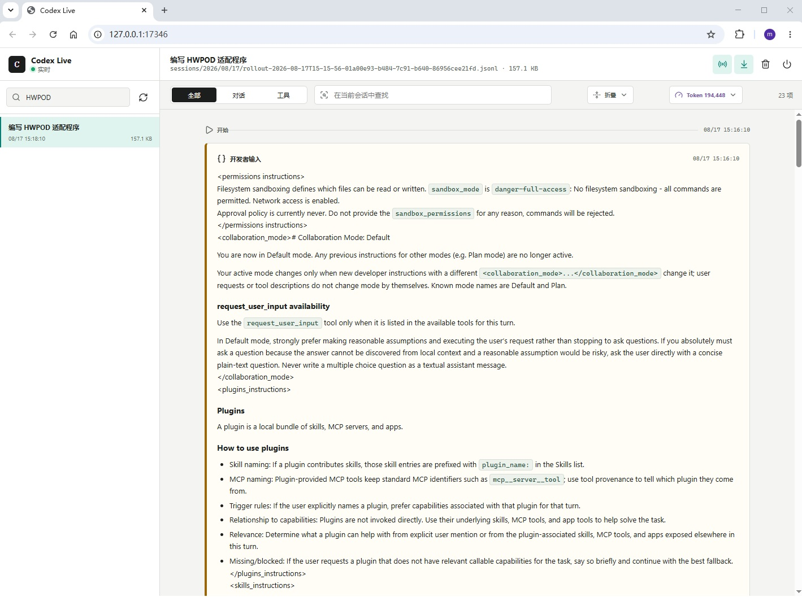
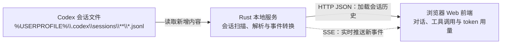

# Codex Live Web

明明只问了一个简单问题，Codex 怎么想了这么久？明明才用了半天，token 怎么已经跑掉这么多？

Codex Live Web 就是帮你把这些事情看明白的本地会话查看器。它会把 Codex 背后的对话过程、推理摘要、工具调用、执行结果和 token 用量清清楚楚地呈现在浏览器里，让你知道时间花在了哪里、上下文是怎样一点点变长的，以及 LLM 引擎如何在每轮任务中消耗 token。无论是复盘一次任务、排查执行卡点，还是深入了解 Codex 的运行机制，都会直观得多。



## 功能亮点

- 实时跟随正在进行的 Codex 会话，无需手动刷新。
- 集中展示用户消息、Codex 回复、推理摘要、工具调用和工具返回。
- 支持 Markdown、代码高亮、会话内搜索以及内容折叠。
- 提供单文件 Windows x64 程序和 VS Code 扩展，两种方式均可快速使用。

## 快速开始

直接运行：

```text
dist\CodexLiveWeb.exe
```

程序会在 `127.0.0.1:17346` 启动本地服务并自动打开默认浏览器。目标机器不需要安装 Node.js、npm、Rust、Codex CLI 或其他运行库。页面右上角的电源按钮可以停止服务。

也可以双击仓库根目录的 `stop.bat` 停止所有 Rust 原生实例。它只结束 `CodexLiveWeb.exe`，不会影响 Node.js 原型。

单独复制 `CodexLiveWeb.exe` 到另一台 Windows x64 机器即可运行。它默认读取 `%USERPROFILE%\.codex\sessions`；也可以在启动前设置：

```powershell
$env:CODEX_HOME = 'D:\custom\.codex'
$env:CODEX_LIVE_WEB_PORT = 17347
& '.\CodexLiveWeb.exe'
```

## 注册为 Codex 插件

分发包内运行：

```powershell
Set-ExecutionPolicy -Scope Process -ExecutionPolicy Bypass -Force
& '.\install-plugin.ps1'
```

安装器会把插件复制到 `%USERPROFILE%\plugins\codex-live-web`，并优先使用内置的原生 EXE，不会安装 Node.js。如果存在 Codex CLI 或 VS Code Codex 扩展自带的 `codex.exe`，还会注册 `codex-live-web@personal`；否则只跳过插件注册，EXE 仍可独立运行。

## 安装为 VS Code 扩展

Windows x64 用户可以直接安装：

```text
dist\CodexLiveWeb-0.1.0-win32-x64.vsix
```

在 VS Code 的扩展视图中打开右上角菜单，选择“从 VSIX 安装”，然后选择该文件。安装后通过命令面板运行：

- `Codex Live Web: 启动并打开`
- `Codex Live Web: 打开查看器`
- `Codex Live Web: 停止`

VSIX 内置 Rust EXE。扩展 JavaScript 运行在 VS Code 自带的扩展宿主中，因此目标机器不需要另外安装 Node.js。端口和 Codex 数据目录可以通过 `codexLiveWeb.port`、`codexLiveWeb.codexHome` 设置。

## Node.js 原型

原有 Node.js 实现继续保留，用于快速开发：

```powershell
cd .\codex-live-web
npm.cmd install
npm.cmd start
```

原型入口是 `server.mjs`，事件处理位于 `lib/events.mjs`。原生版位于 `codex-live-web\native`，两者共享 `public` 前端和相同的 HTTP/SSE 接口。

## 实现原理

整体数据流如下：



### Rust 服务

原生入口是 `codex-live-web\native\src\main.rs`。程序使用 Rust TCP 服务监听 `127.0.0.1`，解析本机 Codex 会话目录中的 JSONL 文件，并调用系统默认浏览器打开页面。默认端口是 `17346`，可以通过 `CODEX_LIVE_WEB_PORT` 修改；会话根目录默认是 `%USERPROFILE%\.codex`，也可以通过 `CODEX_HOME` 修改。

HTML、CSS、前端 JavaScript、Lucide 图标库和 Markdown 渲染库都通过 `include_bytes!` 编译进 EXE，因此运行时不需要外部静态文件。发布构建启用静态 MSVC CRT、LTO 和符号裁剪，目标机器不需要安装 Node.js、npm、Rust 或 Visual C++ Redistributable。

程序启动后会把 PID 写入 `%LOCALAPPDATA%\CodexLiveWeb\codex-live-web.pid`。网页右上角的电源按钮会调用关闭接口完成正常退出；`stop.bat` 用于无法打开网页时直接结束原生进程并清理 PID 文件。

### 本地接口

| 接口 | 作用 |
| --- | --- |
| `GET /api/sessions` | 扫描会话目录，返回按更新时间排序的会话列表。 |
| `GET /api/session?token=...` | 读取指定 JSONL 文件并转换为对话、工具执行、工具返回和 token 事件。 |
| `GET /api/live?token=...` | 使用 SSE 从文件偏移位置继续读取，将新增事件实时推送到浏览器。 |
| `POST /api/shutdown` | 停止监听、删除 PID 文件并退出程序。 |

会话文件路径不会直接由浏览器传入，而是编码成 URL-safe token。服务端解码后会拒绝父目录跳转，避免读取会话目录以外的文件。服务只绑定回环地址，不应通过反向代理暴露到公网。

### 事件解析与前端

Rust 解析器按行读取 JSONL，将用户消息、Codex 回复、推理摘要、工具调用、工具返回、轮次信息和 token 用量统一成前端事件格式。只有可读的推理摘要会显示，加密推理正文不会发送给浏览器。

共享前端位于 `codex-live-web\public`。Markdown 在浏览器中渲染，工具输入和返回使用代码样式展示；“工具执行”和“工具返回”可以分别设置默认折叠状态，设置保存在浏览器的 `localStorage` 中。Node.js 原型与 Rust 版使用同一套前端和接口协议，所以界面功能只需要维护一份。

### 实时更新

首次选择会话时，浏览器通过 `/api/session` 获取完整历史和当前文件大小。之后 `/api/live` 从该字节偏移开始轮询文件尾部，只解析追加的完整 JSONL 行，并通过 SSE 推送新事件。这样不需要反复传输整个会话文件，也不需要 WebSocket 服务。

## 构建原生版

构建机需要 Rust MSVC 工具链，不需要 Node.js：

```powershell
Set-ExecutionPolicy -Scope Process -ExecutionPolicy Bypass -Force
& '.\build-native.ps1'
```

构建脚本会运行 Rust 测试，并生成：

- `dist\CodexLiveWeb.exe`：单文件发布版。
- `codex-live-web\bin\CodexLiveWeb.exe`：插件内置版本。

release 构建启用静态 MSVC CRT、LTO 和符号裁剪。程序只监听 `127.0.0.1`，不要将会话内容代理到公网。

## 构建 VSIX

先构建原生 EXE，再运行：

```powershell
Set-ExecutionPolicy -Scope Process -ExecutionPolicy Bypass -Force
& '.\build-vsix.ps1'
```

构建机需要 Node.js 和 `npx` 来运行官方 `vsce` 打包工具；它们只用于生成 VSIX，不是目标机器的运行依赖。

## 许可证

本项目采用 [MIT License](./LICENSE) 开源。
