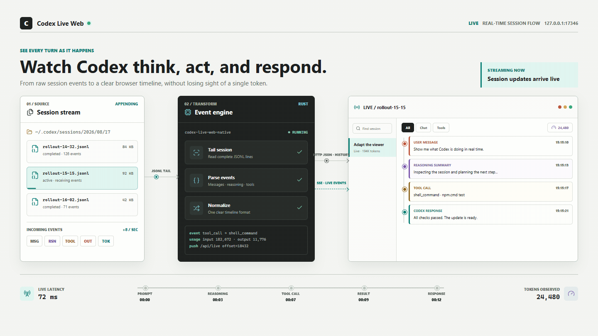
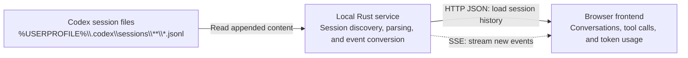

# Codex Live Web

English | [简体中文](./README.zh-CN.md)

Ever asked Codex one simple question and wondered why the answer took so long? Used it for only half a day, yet somehow watched the token count shoot through the roof?

Codex Live Web is a real-time browser viewer that lets you watch Codex work as it happens. As a session unfolds, it brings the conversation, reasoning summaries, tool calls, execution results, and token usage together in one clear timeline, so you can see where the time goes, how the context grows, and how the LLM consumes tokens from one turn to the next. Whether you are reviewing a task, tracking down a slow step, or simply curious about how Codex works under the hood, the whole process becomes much easier to understand.



## Highlights

- Follow active Codex sessions in real time without manually refreshing the page.
- Browse user messages, Codex responses, reasoning summaries, tool calls, and tool results in one place.
- Render Markdown and highlighted code, search within a session, and collapse noisy details.
- Get started quickly with either a standalone Windows x64 executable or a VS Code extension.

## Quick Start

Run the standalone executable:

```text
dist\CodexLiveWeb.exe
```

The app starts a local server at `127.0.0.1:17346` and opens it in your default browser. The target machine does not need Node.js, npm, Rust, the Codex CLI, or any additional runtime. Use the power button in the top-right corner of the page to stop the service.

You can also double-click `stop.bat` in the repository root to stop all native Rust instances. It only terminates `CodexLiveWeb.exe` and does not affect the Node.js prototype.

The executable is portable: copy `CodexLiveWeb.exe` to another Windows x64 machine and run it there. By default, it reads `%USERPROFILE%\.codex\sessions`. To use a different Codex data directory or port, set the environment variables before starting it:

```powershell
$env:CODEX_HOME = 'D:\custom\.codex'
$env:CODEX_LIVE_WEB_PORT = 17347
& '.\CodexLiveWeb.exe'
```

## Register as a Codex Plugin

Run the installer from the distribution root:

```powershell
Set-ExecutionPolicy -Scope Process -ExecutionPolicy Bypass -Force
& '.\install-plugin.ps1'
```

The installer copies the plugin to `%USERPROFILE%\plugins\codex-live-web` and prefers the bundled native executable, so it does not install Node.js. If it finds either a standalone Codex CLI or the `codex.exe` bundled with the VS Code Codex extension, it also registers `codex-live-web@personal`. Otherwise, it skips registration and leaves the standalone executable fully usable.

## Install the VS Code Extension

Windows x64 users can install the bundled VSIX directly:

```text
dist\CodexLiveWeb-0.1.0-win32-x64.vsix
```

Open the menu in the top-right corner of VS Code's Extensions view, choose **Install from VSIX...**, and select the file. After installation, use the Command Palette to run:

- `Codex Live Web: 启动并打开` (Start and Open)
- `Codex Live Web: 打开查看器` (Open Viewer)
- `Codex Live Web: 停止` (Stop)

The VSIX bundles the native Rust executable. Its JavaScript runs inside VS Code's extension host, so the target machine does not need a separate Node.js installation. Configure the port and Codex data directory with `codexLiveWeb.port` and `codexLiveWeb.codexHome`.

## Node.js Prototype

The original Node.js implementation remains available for fast development:

```powershell
cd .\codex-live-web
npm.cmd install
npm.cmd start
```

The prototype starts from `server.mjs`, with event processing in `lib/events.mjs`. The native implementation lives in `codex-live-web\native`. Both versions share the `public` frontend and the same HTTP/SSE contract.

## How It Works

The overall data flow looks like this:



### Rust Service

The native entry point is `codex-live-web\native\src\main.rs`. A Rust TCP service listens on `127.0.0.1`, parses JSONL files from the local Codex session directory, and opens the page in the system's default browser. The default port is `17346`; change it with `CODEX_LIVE_WEB_PORT`. The session root defaults to `%USERPROFILE%\.codex`; change it with `CODEX_HOME`.

The HTML, CSS, frontend JavaScript, Lucide icon library, and Markdown renderer are all compiled into the executable with `include_bytes!`, so no external static files are required at runtime. Release builds use a static MSVC CRT, LTO, and symbol stripping. The target machine therefore does not need Node.js, npm, Rust, or the Visual C++ Redistributable.

At startup, the app writes its PID to `%LOCALAPPDATA%\CodexLiveWeb\codex-live-web.pid`. The power button calls the shutdown endpoint for a clean exit. If the page is unavailable, `stop.bat` terminates the native process and removes the PID file.

### Local API

| Endpoint | Purpose |
| --- | --- |
| `GET /api/sessions` | Scan the session directory and return sessions ordered by modification time. |
| `GET /api/session?token=...` | Read one JSONL file and convert it into conversation, tool, result, and token events. |
| `GET /api/live?token=...` | Continue reading from a file offset and stream newly appended events over SSE. |
| `POST /api/shutdown` | Stop the listener, remove the PID file, and exit the process. |

The browser never sends a raw session file path. Paths are encoded as URL-safe tokens, and the server rejects parent-directory traversal after decoding. The service binds only to the loopback interface and should not be exposed to the public internet through a reverse proxy.

### Event Parsing and Frontend

The Rust parser reads JSONL line by line and converts user messages, Codex responses, reasoning summaries, tool calls, tool results, turn metadata, and token usage into a shared frontend event format. Only readable reasoning summaries are displayed; encrypted reasoning content is never sent to the browser.

The shared frontend lives in `codex-live-web\public`. Markdown is rendered in the browser, while tool inputs and outputs use code formatting. Tool calls and tool results have separate default-collapse settings stored in `localStorage`. Because the Node.js prototype and Rust service use the same frontend and API contract, the interface only needs to be maintained once.

### Live Updates

When you first select a session, the browser requests its full history and current file size from `/api/session`. It then asks `/api/live` to poll from that byte offset, parse only newly appended complete JSONL lines, and push them over SSE. This avoids retransmitting the entire session and does not require a WebSocket server.

## Build the Native Version

The build machine needs the Rust MSVC toolchain, but does not need Node.js:

```powershell
Set-ExecutionPolicy -Scope Process -ExecutionPolicy Bypass -Force
& '.\build-native.ps1'
```

The build script runs the Rust tests and produces:

- `dist\CodexLiveWeb.exe`: the standalone single-file release.
- `codex-live-web\bin\CodexLiveWeb.exe`: the executable bundled with the plugin.

Release builds use a static MSVC CRT, LTO, and symbol stripping. The app listens only on `127.0.0.1`; do not proxy session content to the public internet.

## Build the VSIX

Build the native executable first, then run:

```powershell
Set-ExecutionPolicy -Scope Process -ExecutionPolicy Bypass -Force
& '.\build-vsix.ps1'
```

The build machine needs Node.js and `npx` to run the official `vsce` packaging tool. They are only build-time dependencies and are not required on the target machine.

## License

This project is released under the [MIT License](./LICENSE).
